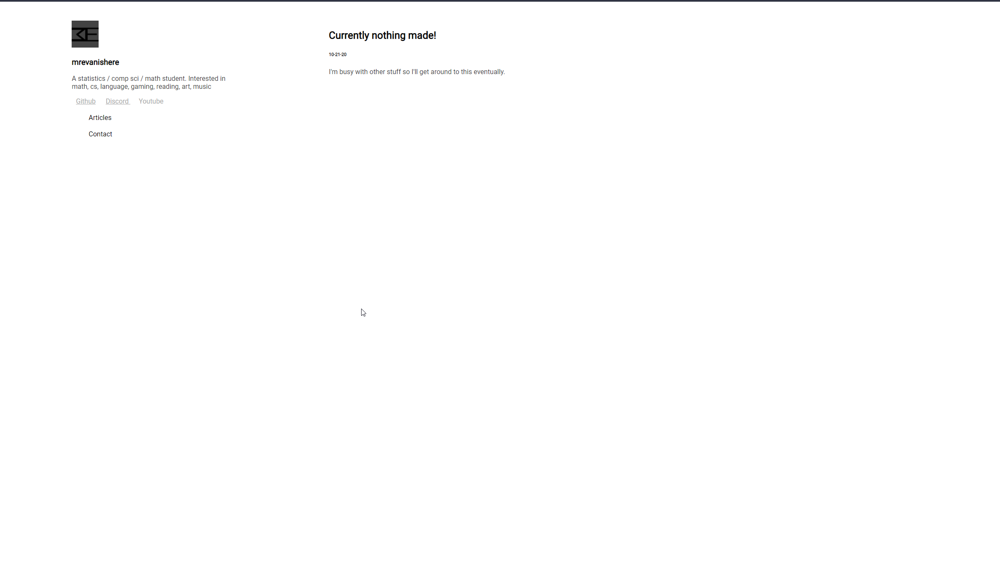
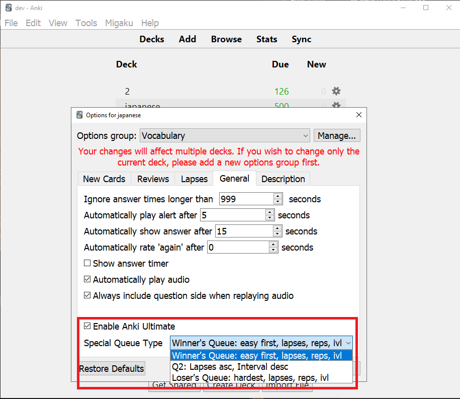

<!-- Skills -->

# MrEvanIsHere
[Portfolio](https://mrevanishere.github.io/)

### Social Media

# Currently working on

[Live-Mocha](https://github.com/mrevanishere/live-mocha)

[MathDiscordBot](https://github.com/mrevanishere/math-discord-bot)

[Coding Challenges](https://github.com/mrevanishere/concepts-tutorials-problems)

# What I'm Reading
* Byrant, O'Hallaron - Computer Systems: A Programmer's Perspective
* Williams - C++ Concurrency In Action 2nd Edition
* Wackerly, Mendenhall, Scheaffer - Mathematical Statistics 7th Edition

# Major Projects

## Voxel Engine

Technologies: C++, OpenGL (GLFW3, GLAD, GLM), CMake, MinGW

## Django Site (My Website)

Technologies: Python, Django, Debian (Linode), Apache (Server), PostgreSQL / SQLite, CSS, HTML

## Anki Add-on

Technologies: Python, PyQT, SQLite, HTML, CSS

## Fraction Calculator

Technologies: Java, JavaCord, JUnit
see mrevanishere/math-discord-bot

## Resume
See my anonymized resume in mrevanishere/resume
